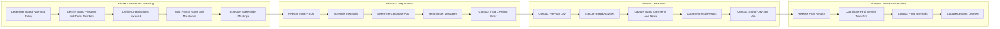

```mermaid
flowchart LR
    %% Define Phases and Steps
    subgraph Phase1[Phase 1: Pre-Board Planning]
        A1[Determine Board Type and Policy]
        A2[Identify Board President and Panel Members]
        A3[Define Organizations Involved]
        A4[Build Plan of Action and Milestones]
        A5[Schedule Stakeholder Meetings]
    end

    subgraph Phase2[Phase 2: Preparation]
        B1[Release Initial PSDM]
        B2[Schedule Townhalls]
        B3[Determine Candidate Pool]
        B4[Send Target Messages]
        B5[Conduct Initial Leveling Brief]
    end

    subgraph Phase3[Phase 3: Execution]
        C1[Conduct Pre-Run Day]
        C2[Execute Board Activities]
        C3[Capture Board Comments and Notes]
        C4[Document Final Results]
        C5[Conduct End-of-Day Tag-Ups]
    end

    subgraph Phase4[Phase 4: Post-Board Actions]
        D1[Release Final Results]
        D2[Coordinate Final Service Transfers]
        D3[Conduct Final Townhalls]
        D4[Capture Lessons Learned]
    end

    %% Connect Phases
    A1 --> A2 --> A3 --> A4 --> A5
    A5 --> B1
    B1 --> B2 --> B3 --> B4 --> B5
    B5 --> C1
    C1 --> C2 --> C3 --> C4 --> C5
    C5 --> D1
    D1 --> D2 --> D3 --> D4
```